

    

______________________________________________________________________

# ANY.RUN Malware Sandbox Integration with Microsoft Defender for Endpoint 

## Overview

This connector integrates Microsoft Defender for Endpoint (MDE) with the [ANY.RUN Sandbox](https://any.run/features/?utm_source=anyrungithub&utm_medium=documentation&utm_campaign=ms_defender_tifeeds&utm_content=linktosandboxlanding) to enrich MDE alerts through automated malware analysis. It triggers automatically upon the registration of a new alert in MDE, extracting and analyzing entities such as URLs or files associated with the alert.

The enrichment process adds valuable context directly to the alert: comments include the ANY.RUN verdict, threat score, a link to the detailed analysis report, and any Indicators of Compromise (IOCs) discovered during the sandbox detonation. Extracted IoCs are also imported into MDE's local Threat Intelligence lists for enhanced detection and response.

This connector empowers SOC teams with deeper insights into potential threats, accelerating triage, reducing false positives, and enabling proactive hunting — all while leveraging ANY.RUN's interactive sandbox capabilities for real-time behavioral analysis.

## Requirements
- Microsoft Defender for Endpoint
- ANY.RUN API Key. To obtain it, please contact your [ANY.RUN account manager](https://app.any.run/contact-us/?utm_source=anyrungithub&utm_medium=documentation&utm_campaign=ms_defender_sandbox&utm_content=linktocontactus) directly or fill out [the request form](https://any.run/demo/?utm_source=anyrungithub&utm_medium=documentation&utm_campaign=ms_defender_sandbox&utm_content=linktodemo).
- Microsoft Azure resources:
  - Logic App Consumption plan
  - Function App Flex Consumption plan
  - Blob Storage

For production deployments, use the automated installer described in
[`../AUTOMATED-DEPLOYMENT.md`](../AUTOMATED-DEPLOYMENT.md). Manual ARM deployment
details and the asynchronous runtime model are documented in
[`DEPLOY-TO-AZURE.md`](DEPLOY-TO-AZURE.md).

## Solution Overview

The connector uses a tracked asynchronous workflow:

1. The Logic App starts `ANYRUN-Sandbox-MDE-FA`.
2. The starter validates the request, creates a private job-status record, puts
   the work on the `anyrun-mde-jobs` queue, and returns `202 Accepted` with a
   `job_id` in a few seconds. A transient status-blob write is retried before
   enqueue; a persistent failure returns `500` without creating queue work.
3. `ANYRUN-Sandbox-MDE-Worker` performs Live Response, submits every available
   file or URL to ANY.RUN, waits for the result, and enriches the Defender alert.
4. While the worker runs, the Logic App polls the short-lived
   `ANYRUN-Sandbox-MDE-Status` Function. Run history therefore shows separate
   **Evidence submitted to ANY.RUN** and **ANY.RUN verdict received** actions.

Long-running work never remains inside an HTTP request. This avoids the Logic
App/Function HTTP timeout while still keeping the outcome visible in the same
Logic App run.

### Recovery after a worker restart

Queue delivery is attempted up to three times. After an ordinary worker failure,
`visibilityTimeout` delays retry by 60 seconds (previously five minutes), plus
queue polling and scheduling time. This allows faster recovery from transient
failures, but uses the three attempts sooner during a sustained outage. It does
not change Azure's ten-minute visibility timeout after a host crash or bypass
the submission checkpoints that prevent duplicate paid tasks.

The worker stores a durable
checkpoint for each evidence before submission and immediately after receiving
its ANY.RUN task UUID. A retry resumes the same saved task without collecting
its file or paying for another analysis. Saved verdicts and completed enrichment
steps are reused. A renewing, 60-second blob lease prevents overlapping workers
for the same job; it expires if the process dies.

The worker writes a best-effort heartbeat every minute, including during Live
Response. Heartbeats do not grow the transition history. The Status endpoint is
read-only and projects an inactive nonterminal job as `failed/stale` after
15 minutes without updates. This does not prove the analysis failed: Storage
may be unavailable, and the task link remains the source for the sandbox result.
Azure may return a crashed host's queue message after ten minutes, so the stale
threshold intentionally leaves time for recovery and cold start.

Verdict waiting uses bounded report requests every 20 seconds instead of an SSE
stream. The deadline reads `opt_timeout` from the Logic App and adds a ten-minute
margin. Reported remaining time or an explicit running status can extend it,
subject to the persisted 90-minute overall budget, including retry delays.

Report polling tolerates HTTP 404/409/425/429/5xx and transport failures inside
the wait budget, with at most ten consecutive errors per delivery. Completion
requires an explicit `done`/`completed`/100 status and a verdict; a missing or
unknown status never turns a provisional verdict into a final one. Validate
the running and completed report schema against your tenant before acceptance.
GET requests are bounded at 60 seconds; paid analysis POSTs have a separate
300-second limit, both capped by the remaining job budget. Explicit submission
rejections (400/401/403/413/422) are terminal; an explicit 429 clears the intent
and permits queue retry. Ambiguous POST failures still require manual recovery.

Update both the Function ZIP and the Logic App submission loop limits:
480 iterations and `PT2H`. Changing only the timeout leaves the old 240-iteration
limit in place. Preserve your existing analysis options and connection settings.

**Resubmit in Logic App creates a new job and can create another paid task.**
For an interrupted job, first inspect its status blob and task UUID. After
installing this update, replay the original queue payload with the **same job ID**
to resume a recoverable job. Do not remove its status blob. Already terminal
failed jobs require investigation before a deliberate recovery change.

If the paid POST may have succeeded but no UUID was saved, the worker reports
`RecoveryRequired` and refuses automatic resubmission. A hash match in account
history is insufficient to identify the right task. Check the account history
and restore the exact UUID before recovery. Comment checkpoints and checks of
existing Defender comments avoid ordinary replay duplicates; the remote
comment API has no transaction shared with Blob, so exactly-once writes across
both systems cannot be guaranteed during an ambiguous network failure.

Deployment requirements and tenant verification steps are in
[`DEPLOY-TO-AZURE.md`](DEPLOY-TO-AZURE.md).

## Prerequisites

### App Registration

- You need to create a new application for your connector. To do this, go to **Microsoft Entra ID**.

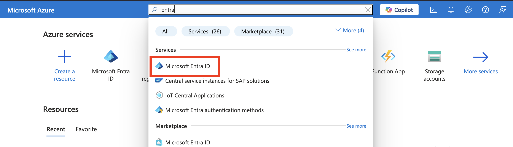

- Click **Add** > **App registration**.

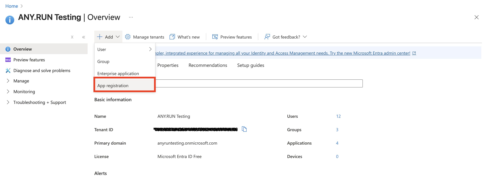

- Name your new application and click **Register**.

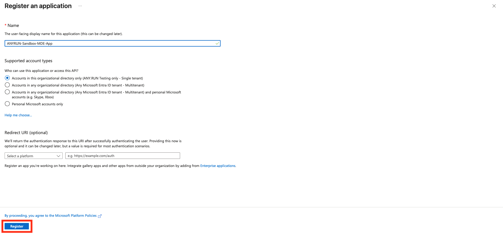

### Secret Value of created App

- To generate the Client Secret, go to your application's page and click **Generate Secret** in the **Certificates & secrets** tab.

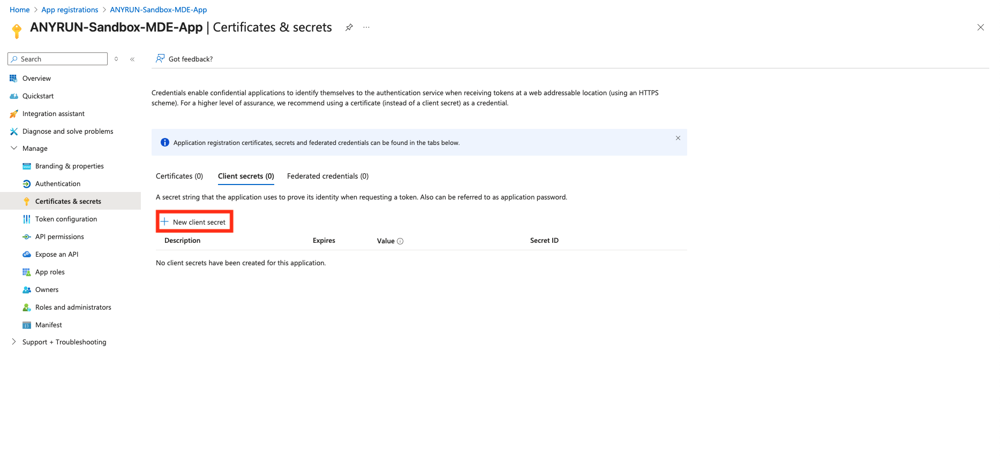

- Specify the key name and its expiration date (optional).

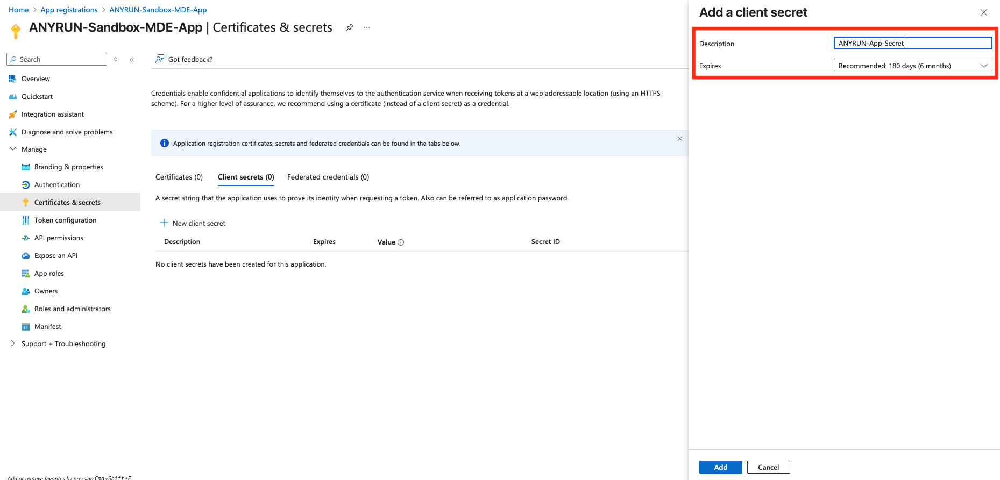

- Copy and **save the Secret Value**. This value is required for deploying the connector later.

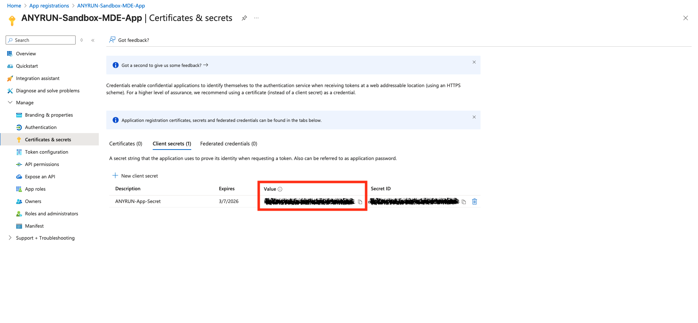

### Microsoft Defender ATP API Permissions for new App

- For the created application, add the following permissions for API connections in the **Manage** > **API permissions** > **Add a permission** tab:

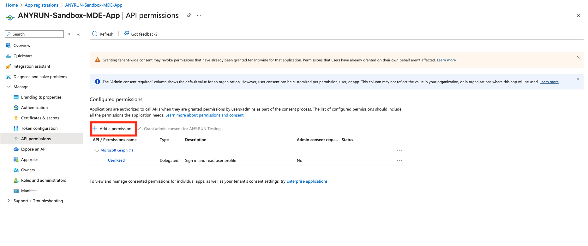

- Add an API connection for **WindowsDefenderATP**. Select the corresponding API in the **APIs my organization uses** tab.

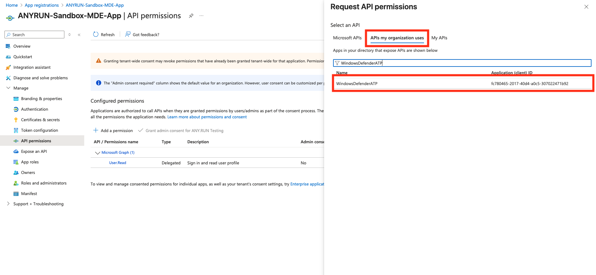

- Then, select **Application permissions**.

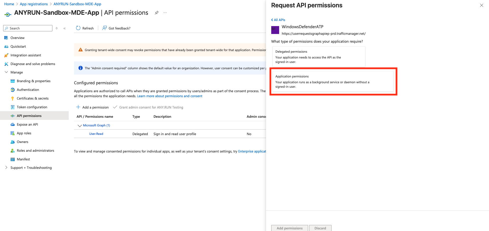

- Select the following permissions:

|       Category       |   Permission Name   | Description                                                            |
|----------------------|---------------------|------------------------------------------------------------------------|
| Alert                | Alert.ReadWrite.All | Needed to enrich alerts with sample information                        |
| Machine              | Machine.LiveResponse | Starts and cancels Live Response actions                              |
| Machine              | Machine.Read.All    | Retrieves machine information                                         |
| Machine              | Machine.ReadWrite.All | Lists and reads MachineAction objects and downloads Live Response results |
| Ti                   | Ti.ReadWrite        | Submits indicators found by ANY.RUN                                   |
| Library              | Library.Manage      | Needed to upload custom ps1 script for retrieving AV related evidences |

`Machine.ReadWrite.All` is required for application tokens by the
`machineactions` and `GetLiveResponseResultDownloadLink` APIs. Granting only
`Machine.LiveResponse` is not sufficient for this connector.

### Storage Account

- Go to Azure Storage Accounts.

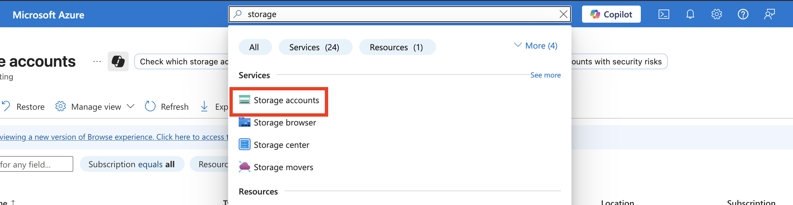

- Click **Create**.

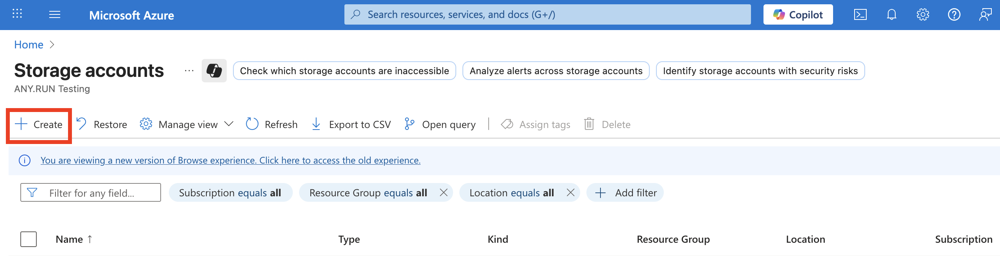

- Type the name of Storage Account and click **Review + Create**.

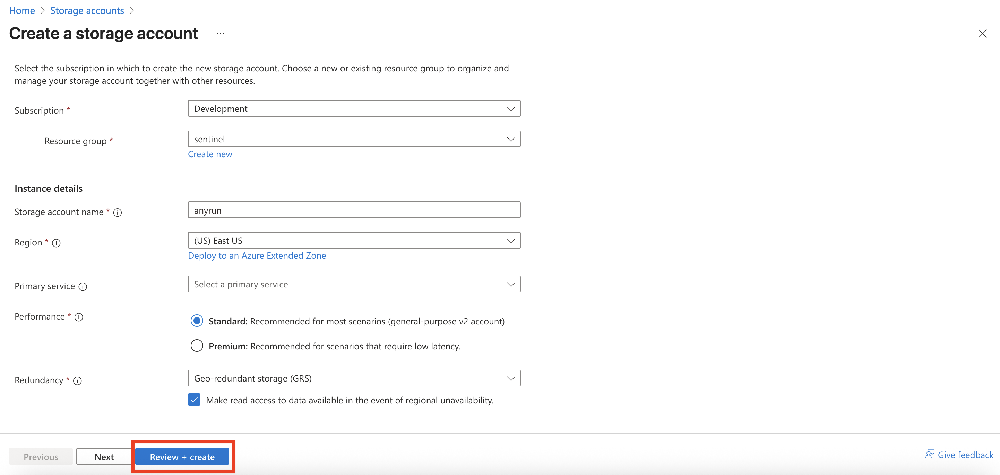

- Open your Storage Account. Go to **Data Storage** > **Containers**.

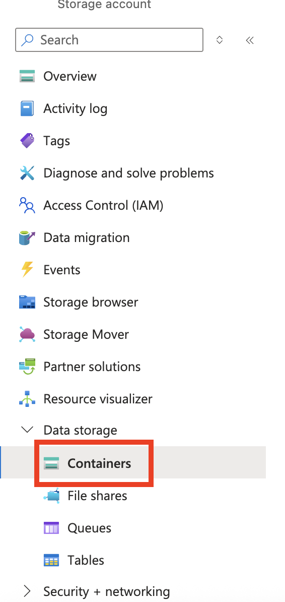

- Click **Add container**, type the **Name** for it and **Create**.

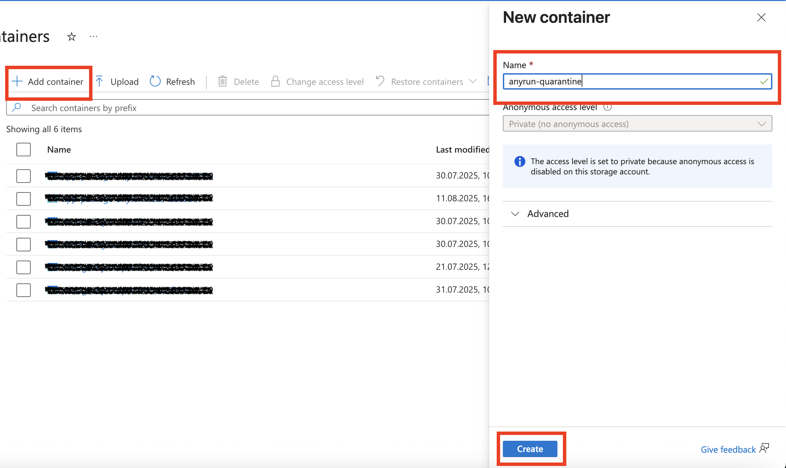

- Go to **Security + networking** > **Access keys**, copy and save **Key** and **Connection string**. These values are required for deploying the connector later.

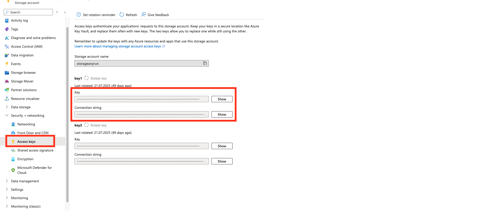
 
## Deployment

### Deploy Azure Function App

- Click below to deploy Azure Function App with **Flex Consumption plan**
 

- Enter the parameters required for deploying the Function App and click **Review + create**.

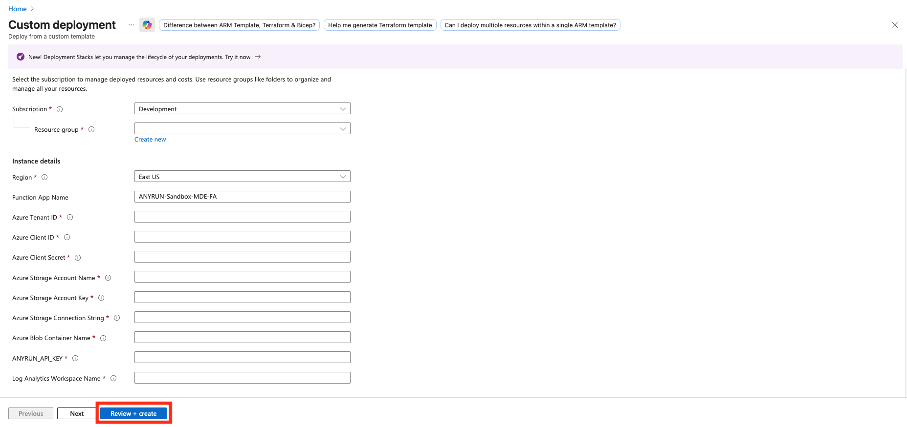

- Description of the required parameters:

| Parameter Name               | Description                                                                 |
|------------------------------|-----------------------------------------------------------------------------|
| functionAppName              | Workflow name.                                                              |
| AzureTenantID                | Azure Tenant ID for authentication.                                         |
| AzureClientID                | Azure Client ID for authentication (ID of the App Registration created before). |
| AzureClientSecret            | Azure Client Secret for authentication.                                     |
| AzureStorageAccountName      | Azure Blob Storage Account Name.                                            |
| AzureStorageAccountKey       | Azure Blob Storage Account Key.                                             |
| AzureStorageConnectionString | Azure Blob Storage Account Connection string.                               |
| AzureBlobContainerName       | Azure Blob Storage Container Name.                                          |
| ANYRUN_API_KEY               | API Key of your ANY.RUN Account.                                            |
| DefenderIndicatorAction      | `Audit` (default) or `Block` for malicious/suspicious indicators.           |
| DefenderIndicatorGenerateAlert | Generate a Defender alert on IOC match; disabled by default.              |
| ConfigureEvidenceLifecyclePolicy | Delete evidence after one day and job status after seven days. Enable only for a dedicated Storage Account. |
| LogAnalyticsWorkspaceName    | Log Analytics Workspace Name.                                               |

### Asynchronous execution

The starter HTTP Function returns `202 Accepted` immediately, and
`ANYRUN-Sandbox-MDE-Worker` performs Live Response, waits for ANY.RUN, and
enriches the alert. `DisableAsyncPattern` applies only to the short starter call;
the Logic App then uses explicit status polling instead of keeping that HTTP
request open.

In **Logic App > Runs history**, open a run and expand these actions:

- **Evidence submitted to ANY.RUN** — job ID, evidence name/type, file SHA-256,
  ANY.RUN task UUID, and task URL;
- **ANY.RUN verdict received** — terminal state plus all analyses, verdicts,
  scores, task links, and IOC counts.

The run stays in progress while the queue worker is active and succeeds only
after the worker stores the final result. Recoverable worker failures leave it
in progress while queue retries resume checkpoints; terminal failures terminate
the run and add a best-effort comment to the Defender alert. Function/Application
Insights remains the detailed diagnostic source.
Job status is stored as JSON in the private `anyrun-job-status` blob container;
API keys, credentials, file bytes, and SAS query strings are never written to
that record.

If Defender enrichment succeeds but the final job-status write fails, the
worker requests a safe queue retry using its saved `enriched` checkpoints.
If Storage remains unavailable, the Logic App may still show `Failed` through
the stale-status projection despite a completed analysis. Use the tracking
warning on the alert and Function logs to investigate; Logic App Resubmit
creates a new job and is not a recovery of the existing task.

Live Response permits only one active session per device. RunScript can execute
for up to 10 minutes. The connector limits its own wait to 15 minutes and does
not cancel another product's session. Avoid running this connector and a
Sentinel playbook against the same device pool.

After Defender accepts a new Live Response action and returns its ID, the worker
waits 10 seconds before the first status check. This initial delay happens only
once per accepted action, not on every status check or failed submission. It is
not a readiness guarantee and does not replace the success-status check.
The subsequent Pending/InProgress polling interval remains 30 seconds.

Its `machineactions` read
endpoint can briefly return `404 ResourceNotFound`. The worker treats only that
specific response as eventual consistency, retries every 10 seconds for up to
3 minutes, and still fails immediately on other HTTP errors.

The worker also has a 90-minute application deadline, leaving time to add a
failure comment before the two-hour Azure Functions timeout. A missing EDR file
does not stop the remaining files or URLs. The AV script succeeds when at least
one requested file was uploaded; Python then reports missing blobs individually.
If RunScript itself fails, the connector makes a best-effort cleanup of every
planned blob.

Defender rejects script parameters containing shell metacharacters such as
`; & | ! $ ( )`. The connector therefore uses a versioned Base64URL envelope.
The Antivirus collection path uses a random blob name and a 30-minute,
create-only SAS scoped to that single blob.

The Function template contains optional lifecycle rules: orphan evidence is
deleted after one day and job-status JSON after seven days. Keep
`ConfigureEvidenceLifecyclePolicy=false` for a shared or existing Storage
Account: Azure stores one lifecycle-policy document per account, so replacing
it could affect unrelated rules. The automated installer enables these rules
only when it created a dedicated Sandbox Storage Account.

The `analysisPrivacyType` Logic App parameter defaults to `owner`. Private tasks
require a compatible ANY.RUN plan; select `bylink` during deployment if the
account does not support `owner`. A by-link analysis is accessible to anyone
who obtains its link and should be an explicit organizational decision.

### Deploy Azure Logic App

- Click below to deploy Azure Logic App with **Flex Consumption plan**
 

- Enter the parameters required for deploying the Logic App and click **Review + create**.

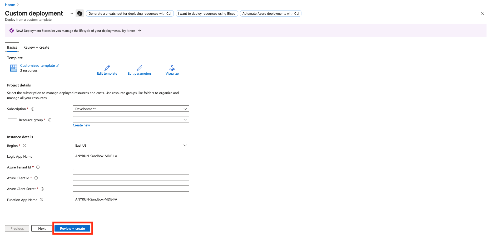

- Description of the required parameters:

| Parameter Name                  | Description                                                                 |
|---------------------------------|-----------------------------------------------------------------------------|
| logicAppName                    | Workflow name.                                                              |
| azureTenantId                   | Azure Tenant ID for authentication in connections.                          |
| azureClientId                   | Azure Client ID for authentication (ID of the App Registration created before). |
| azureClientSecret               | Azure Client Secret for authentication.                                     |
| functionAppName                 | Name of the Function App deplyed before.                                    |
| analysisPrivacyType             | `owner` (default, private-plan support required) or `bylink`.                |

## Microsoft Defender for Endpoint Configuration

> **Note:** To allow the connector to extract all files of interest from endpoints (including potentially dangerous ones), we recommend setting `Quarantine` as the default action for your MDE. **!ATTENTION!** Be careful when configuring antivirus policies, as this can be potentially dangerous. See:
>
> - [Configure remediation for Microsoft Defender Antivirus detections](https://learn.microsoft.com/en-us/defender-endpoint/configure-remediation-microsoft-defender-antivirus)
>
> - [Settings for Microsoft Defender Antivirus policy in Microsoft Intune for Windows devices](https://learn.microsoft.com/en-us/intune/intune-service/protect/antivirus-microsoft-defender-settings-windows)

### Enable Live Response Sessions

- Open your [MDE portal](https://security.microsoft.com).

- Navigate to **System** > **Settings** > **Endpoints** > **General** > **Advanced features**.

- Enable the following settings: **Live Response**, **Live Response for Servers**, and **Live Response unsigned script execution**.

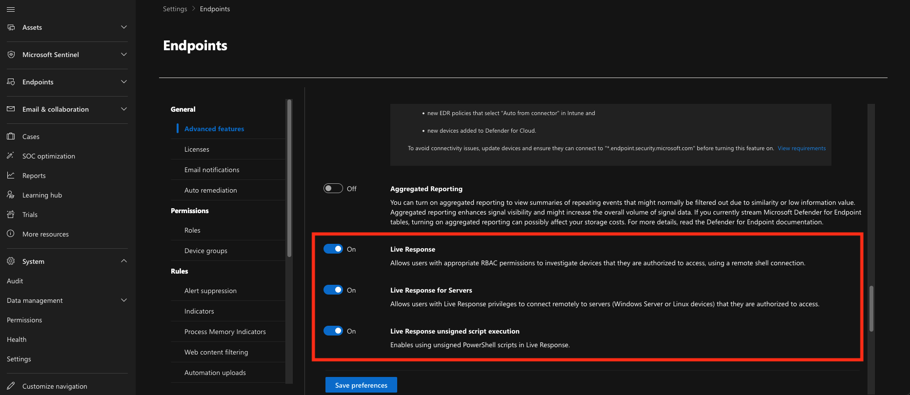

## Logic App Configuration (Optional)

### Customization of Analysis Parameters in the ANY.RUN Sandbox

- The parameters for launching URL or file analysis in the ANY.RUN Sandbox are defined in the deployed Logic App.

- Open your Logic App `ANYRUN-Sandbox-MDE-LA` and navigate to **Development Tools** > **Logic app Designer**.

- The following three actions are responsible for declaring the parameters:

  - `ANY.RUN general analysis options`

  - `ANY.RUN Windows analysis options`

  - `ANY.RUN Linux analysis options`

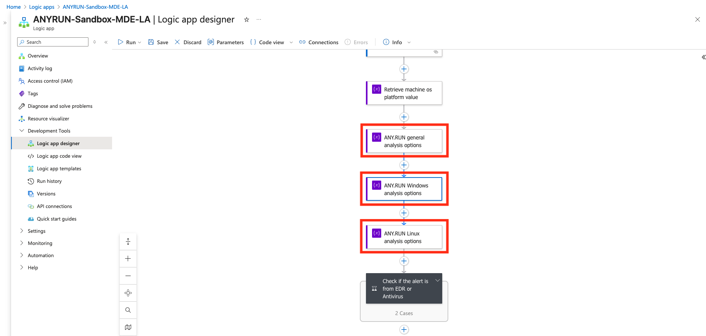

- In the `ANY.RUN general analysis options` action, you can modify parameters that define general, OS-independent options such as analysis duration, virtual machine network settings, privacy, and more. For example, if you need to **increase the initial analysis time** for a more detailed examination of the object, select the **opt_timeout** variable and set the desired value in seconds, for example `360`.

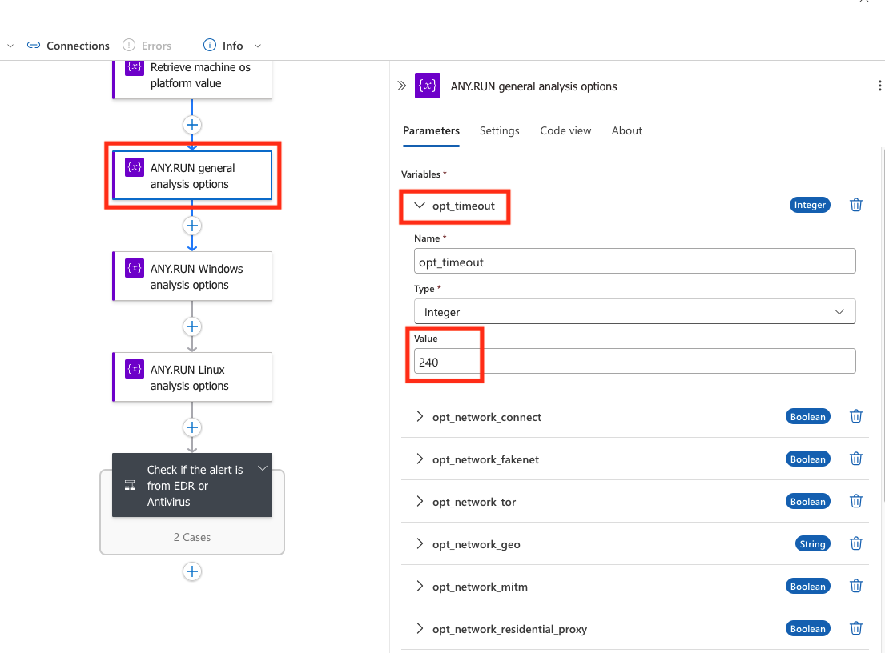

- In the `ANY.RUN Windows analysis options` and `ANY.RUN Linux analysis options` actions, you can modify parameters that affect OS-specific virtual machine settings, such as the OS version and configuration, initial object location and launch parameters, and more. For example, if you need to run the analysis on a virtual machine with Windows 11 instead of Windows 10, click on the `ANY.RUN Windows analysis options` action, select the **windows_env_version** variable, and set the value to `11`.

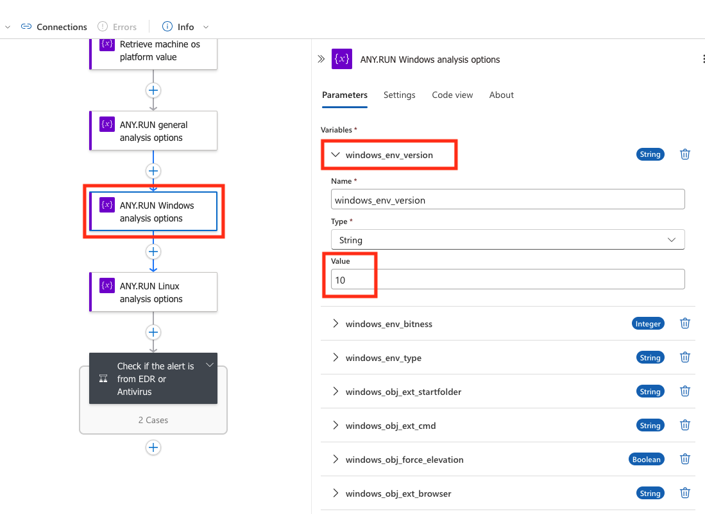

> **Note:** To see the full list of available parameters and their values, visit our **[API documentation](https://any.run/api-documentation/)**.

### Filtering Alerts and Objects for Analysis

Since the trigger in the Logic App for initiating the connector's work is the appearance of a new alert in Microsoft Defender, it is recommended to declare conditions by which the Logic App will filter alerts for subsequent enrichment in the ANY.RUN Sandbox. By default, the condition is specific modules of Microsoft Defender from which the alert came - `WindowsDefenderAtp` and `WindowsDefenderAv`. That is, the connector will process all alerts that come only from these two modules.

- If you need to add one or more additional conditions by which alerts will be filtered, open your Logic App `ANYRUN-Sandbox-MDE-LA` and navigate to **Development Tools** > **Logic app Designer**.

- Find the action `Check if the alert is from EDR or Antivirus` and after the `True` condition, click `+` and select `Add an action` to add a new action.

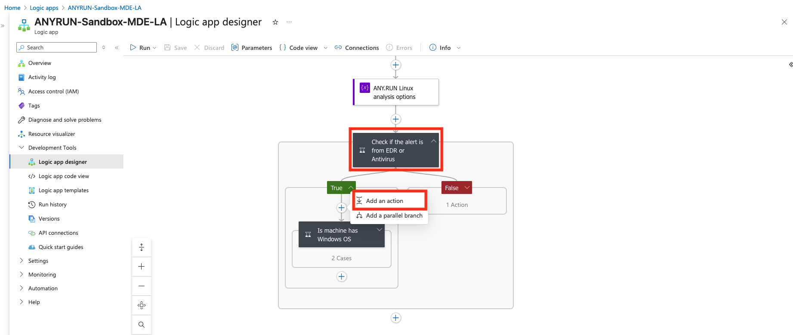

- In the window that appears on the right, in the search bar, find and select `Condition`.

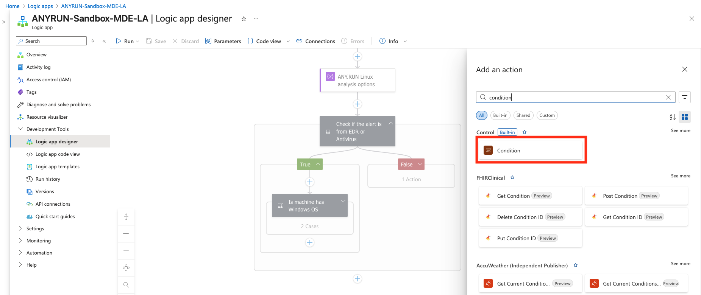

- Then, after the action is added, you need to configure it - change its name (optional) and set the condition itself.

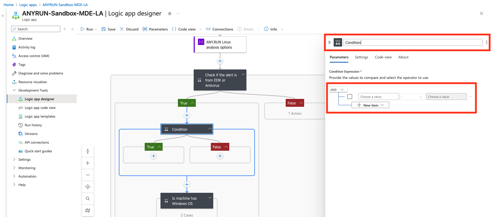

- To filter alerts by their attributes, you can check the `Outputs` of the `Alerts - Get single alert` action.

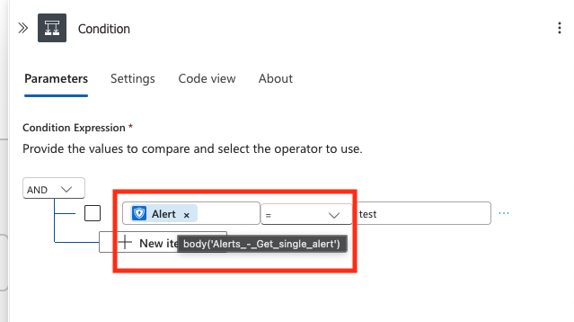

- After you have added the condition, after `False` add a `Terminate` action that will interrupt the further workflow for this alert.

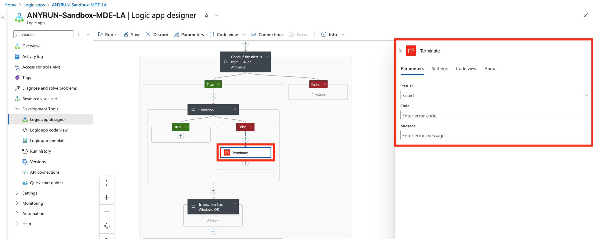

- Drag the actions following the added condition (by default this is `Is machine has Windows OS`) to the `True` section.

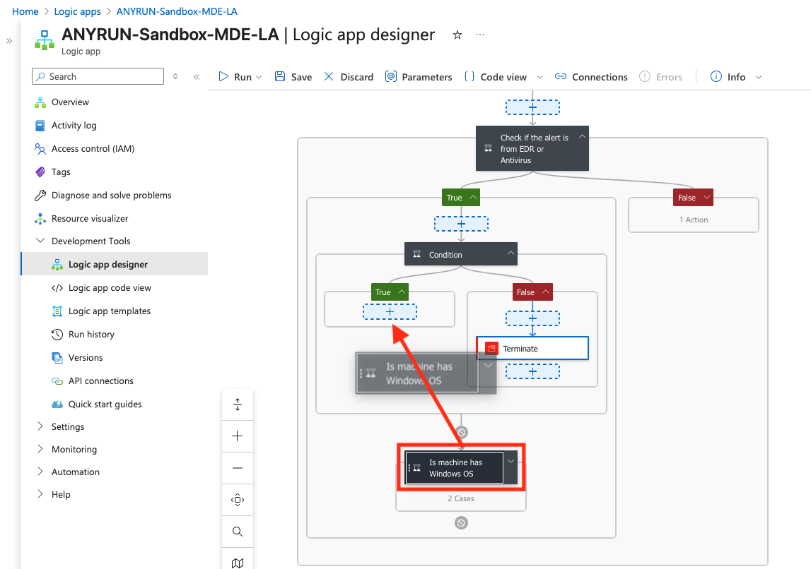

- Save the changes.

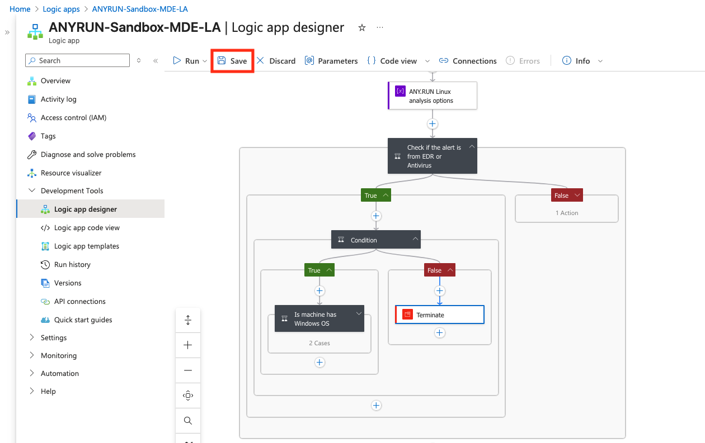

#### Examples of Alert Filtering Conditions

1. Alert Criticality

   - You can enrich with the ANY.RUN Sandbox only alerts with the criticality you need, for example **Medium** or **High**.

   - In the created condition, in the Choose a value field, type `/` and select **Insert dynamic content**.
  
   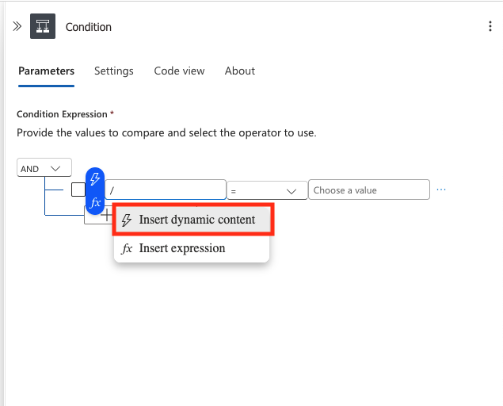

   - As the parameter to check, select `Alert Alert Severity` from the `Alerts - Get single alert` action.
  
   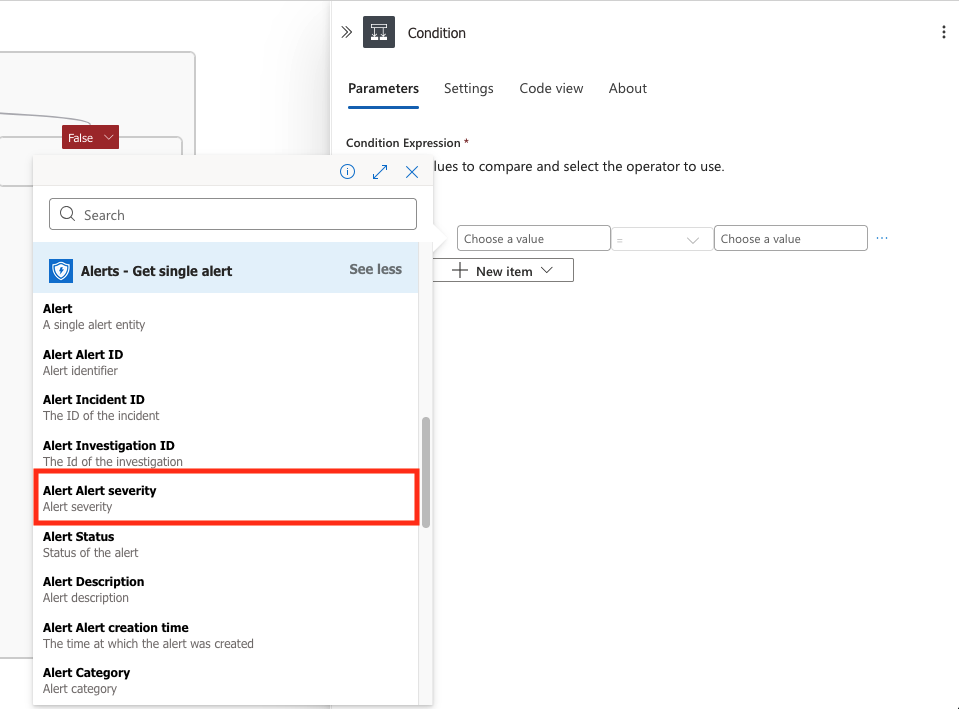

   - Replace the logical operator `AND` with `OR`, click `+ New item` and select `Add row`.
  
   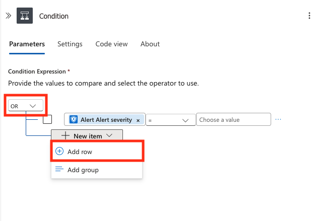

   - In the new row, also add `Alert Alert Severity`.

   - Set the values `High` and `Medium` for the added parameters.

   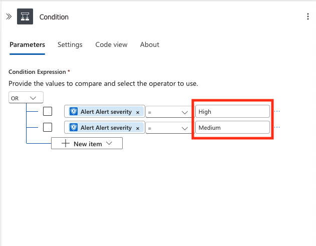

   - Save the changes.
  
   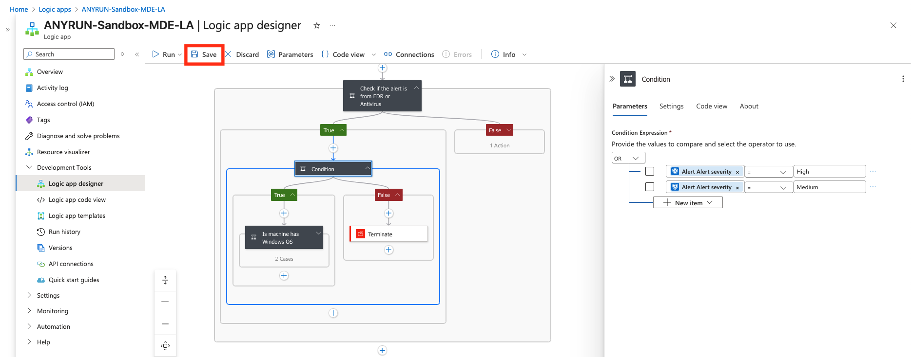

2. Alert Category

   - With the ANY.RUN Sandbox, you can enrich only alerts of the category you need, for example **Malware**.

   - In the created condition, in the Choose a value field, type `/` and select **Insert dynamic content**.
  
   

   - As the parameter to check, select `Alert Category` from the `Alerts - Get single alert` action.

   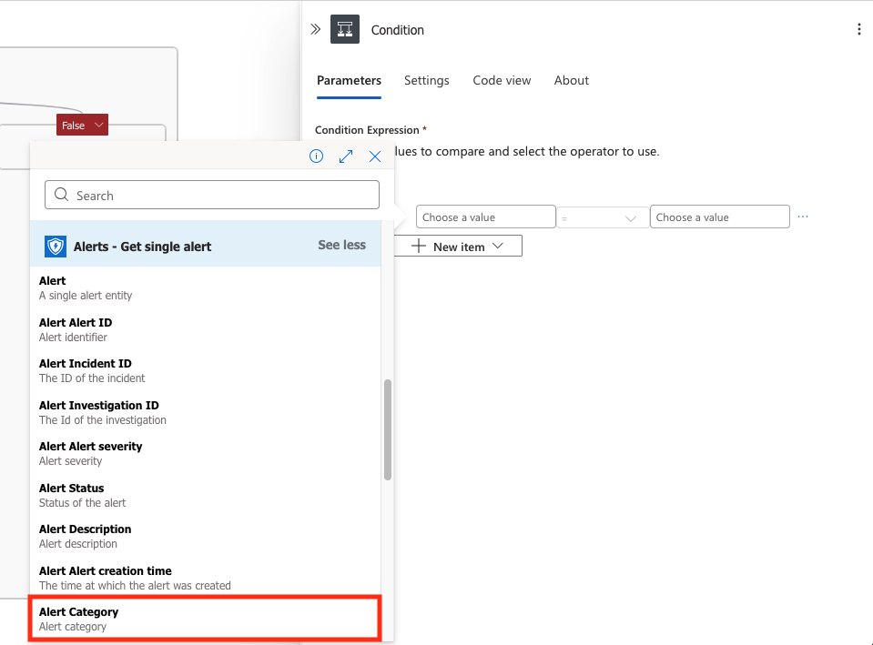
   
   - Set the value `Malware` for the added parameter.

   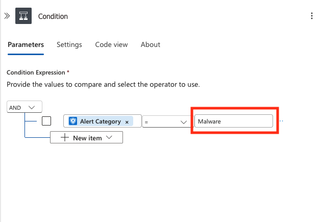
   
   - Save the changes.

   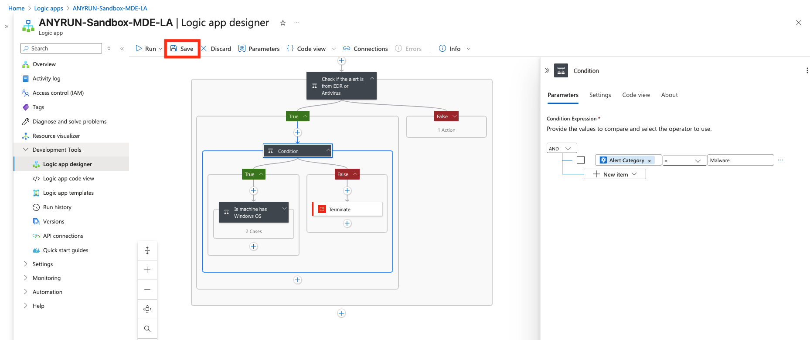
   
3. Machine Properties

   - You can filter alerts depending on the Machine from which it came. For example, you can filter by **Machine tags** or by **RBAC groups** in which the Machine is included.
  
   - In the created condition, in the Choose a value field, type `/` and select **Insert dynamic content**.
  
   

   - As the parameter to check, select `Machine Machine tags` or `Machine RBAC group name` or any other suitable parameter from the `Machines - Get single machine` action.

   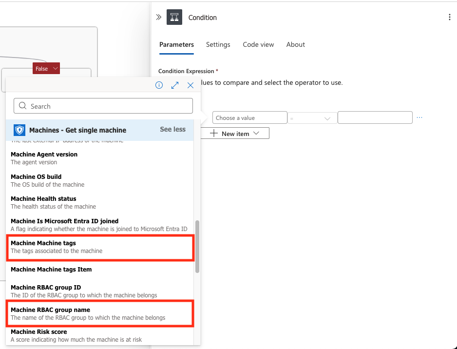
   
   - Set the value corresponding to **your devices** for the added parameter.

   > **Note:** You can find information about your devices at MDE Portal in Assets > Devices tab.

   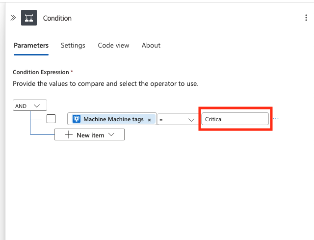

   - Save the changes.

   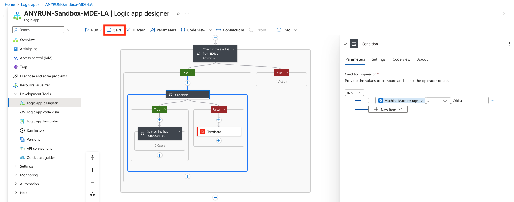
